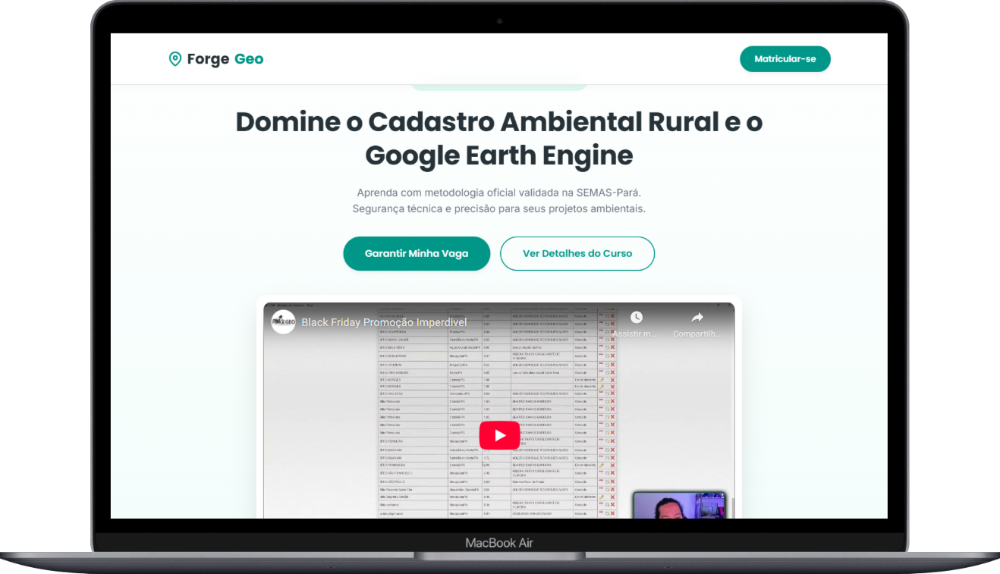

# ForgeGeo

Landing page responsiva desenvolvida para a **ForgeGeo Soluções em Geotecnologia**, focada na venda de cursos de Cadastro Ambiental Rural (CAR) e Google Earth Engine.

## Demo Online
Acesse o projeto ao vivo: [https://samuel-c-santos.github.io/forgegeo/](https://samuel-c-santos.github.io/forgegeo/)

## Preview do Projeto

Abaixo uma demonstração da interface adaptada para diferentes dispositivos.

  <table>
    <tr>
      <td align="center" width="60%">
        
         
        <em>Visualização Desktop</em>
      </td>
      <td align="center" width="35%">
        
         
        <em>Visualização Mobile</em>
      </td>
    </tr>
  </table>

## Tecnologias Utilizadas
* **HTML5 Semantic**
* **CSS3 Moderno** (CSS Variables, Flexbox, CSS Grid)
* **Design System "Pluggis"** (Estilo SaaS Clean)
* **Integração Hotmart** (Botões de checkout)
* **Hospedagem:** GitHub Pages

---
